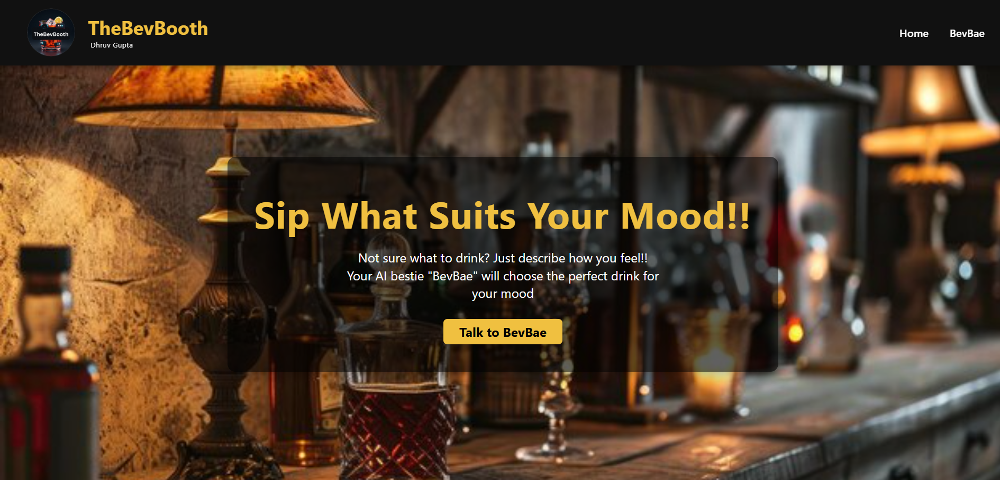
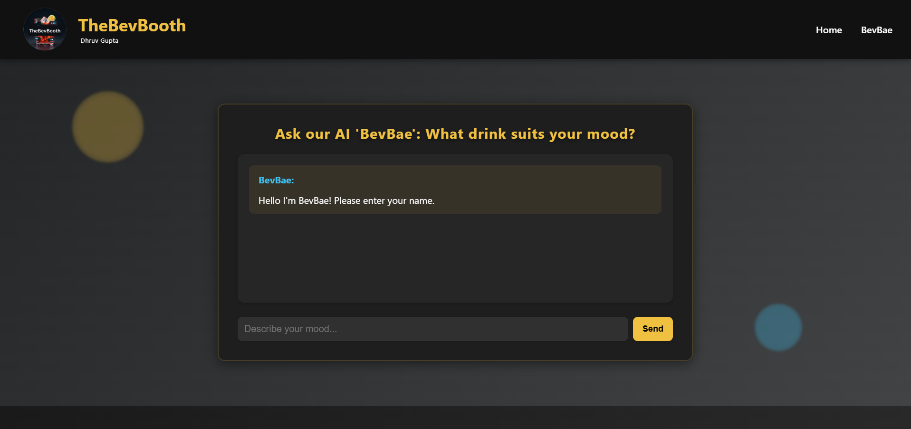

# TheBevBooth

AI-powered beverage companion that suggests drinks based on your mood.

**Author:** Dhruv Gupta  
**Version:** 1.0.0 

---

## Project Overview

**TheBevBooth** is an AI-powered web application that suggests personalized non-alcoholic beverages based on user mood. The application features an interactive AI chatbot named "BevBae" that engages users in a conversational interface to understand their emotional state and recommends appropriate drinks.

---

## Tech Stack

### Frontend
- **HTML5** - Semantic markup for structure
- **CSS3** - Custom styling with:
  - Flexbox for layout
  - CSS Grid (implicit)
  - CSS Animations (keyframes, transitions)
  - Gradient backgrounds
  - Glassmorphism effects (backdrop-filter)
  - Responsive design with media queries
- **Vanilla JavaScript (ES6+)** - No frameworks, pure JavaScript for:
  - DOM manipulation
  - Async/await for API calls
  - Event handling
  - State management (chat flow)

### Backend/API
- **Vercel Serverless Functions** - Node.js runtime
- **Google Gemini AI API** (Gemini 2.0 Flash model) - For AI-powered drink suggestions

### Deployment & Infrastructure
- **Vercel** - Hosting and serverless function deployment
- **Environment Variables** - Secure API key management
- **Static Site Generation** - No build process required

### Development Tools
- **Vercel CLI** - For local development (`vercel dev`)
- **Git** - Version control
- **npm** - Package management

---
## Screenshots 
### Homepage


### AI Chat Page


---
## Architecture

### Application Structure
```
TheBevBooth/
├── Frontend (Static HTML/CSS/JS)
│   ├── home.html - Landing page with banner
│   ├── bevbae.html - AI chat interface
│   ├── coming-soon.html - Placeholder page
│   ├── style.css - Global styles
│   └── Assets (logo.png, banner1.jpg)
│
├── Backend (Serverless)
│   └── api/gemini.js - API proxy function
│
├── Configuration
│   ├── package.json - Project metadata
│   ├── vercel.json - Deployment config
│   ├── .gitignore - Git exclusions
│   └── README.md - Documentation
```

## Features

### Core Functionality
1. **Multi-step Chat Interface**
2. **Mood-Based Drink Recommendations**
3. **AI Integration**
4. **User Experience**
 
### UI/UX Features
- **Glassmorphism Design** - Frosted glass effect on chat container
- **Animated Background** - Floating bubble animations
- **Sticky Navigation** - Header remains visible on scroll
- **Gradient Backgrounds** - Dark theme with gradient overlays
- **Hover Effects** - Interactive button and link states
- **Parallax Effect** - Fixed background attachment on banner

---

## Setup

1. Clone the repository
   ```bash
   git clone <repository-url>
   cd DhruvDRINKS-main
   ```

2. Install dependencies (if needed):
   ```bash
   npm install
   ```

3. Set up environment variables:
   - For local development, create a `.env` file in the root directory
   - Add your Gemini API key:
     ```
     GEMINI_API_KEY=your_api_key_here
     ```
   - Get your Gemini API key from: https://makersuite.google.com/app/apikey

4. Run locally (optional):
   ```bash
   npm run dev
   ```

---

## Security

- The API key is stored securely in Vercel environment variables
- API calls are proxied through a serverless function (`/api/gemini`)
- The API key is never exposed in the client-side code
- Security headers configured (XSS protection, frame options, content type options)

---

## Future Enhancements (Potential)

- User authentication
- Drink favorites/saved recommendations
- Social sharing
- Drink database integration
- Order tracking
- Payment integration
- Multi-language support
- Voice input
- Drink recipe display

---

## Developer Contact

| **Name** | Dhruv Gupta |
| **Email** | dhruvgupta3035@gmail.com |


